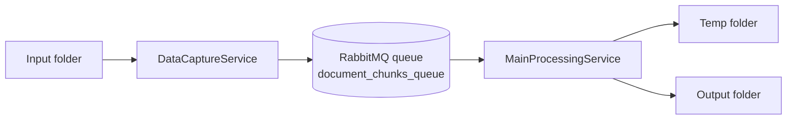
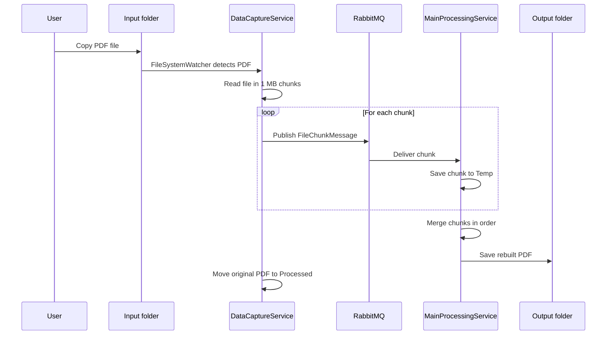

# DocumentProcessingSystem

DocumentProcessingSystem is a simple .NET homework project that shows how two console apps can communicate through RabbitMQ.

- `DataCaptureService` watches an `Input` folder for PDF files.
- `DataCaptureService` splits each PDF into 1 MB chunks.
- Each chunk is sent to RabbitMQ queue `document_chunks_queue`.
- `MainProcessingService` receives the chunks.
- `MainProcessingService` saves the chunks temporarily, rebuilds the PDF, and writes it to `Output`.

## Projects

| Project | Type | Purpose |
| --- | --- | --- |
| `DocumentProcessing.Contracts` | Class library | Contains the shared `FileChunkMessage` class. |
| `DataCaptureService` | Console app | Watches for PDF files and sends chunks to RabbitMQ. |
| `MainProcessingService` | Console app | Receives chunks and rebuilds the final PDF. |

## RabbitMQ

The services use these RabbitMQ settings:

- Host: `localhost`
- Username: `guest`
- Password: `guest`
- Queue: `document_chunks_queue`

You can run RabbitMQ with Docker:

```bash
docker run -d --hostname rabbitmq --name rabbitmq -p 5672:5672 -p 15672:15672 rabbitmq:3-management
```

RabbitMQ Management UI:

```text
http://localhost:15672
```

Login:

```text
guest / guest
```

## How To Run

Build the solution:

```bash
dotnet build
```

Start the receiver first:

```bash
dotnet run --project MainProcessingService
```

Start the sender in another terminal:

```bash
dotnet run --project DataCaptureService
```

Copy a `.pdf` file into:

```text
DataCaptureService/bin/Debug/net8.0/Input
```

After processing:

- The original file is moved to `DataCaptureService/bin/Debug/net8.0/Processed`.
- The rebuilt file is saved to `MainProcessingService/bin/Debug/net8.0/Output`.

## How Chunking Works

The sender reads the PDF in 1 MB pieces. Each piece becomes a `FileChunkMessage`:

- `FileId` groups all chunks from the same file.
- `FileName` keeps the original file name.
- `ChunkIndex` tells the receiver the order of the chunk.
- `TotalChunks` tells the receiver when the full file has arrived.
- `Data` contains the bytes for that chunk.

The receiver stores each chunk in `Temp/{FileId}`. When all chunks exist, it writes them back in `ChunkIndex` order to rebuild the PDF.

## Component Diagram



## Sequence Diagram


